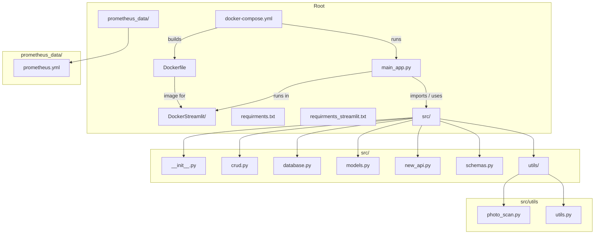

# Keller_Vorrat

Repository overview and quick links.

## Repository Diagram

The detailed repository diagram is in [REPO_INFO.md](REPO_INFO.md).

You can also view the diagram inline (Mermaid):

## Notes

- `REPO_INFO.md` contains the same diagram and extra context.
- If you'd like, I can render the Mermaid diagram to an image and add it here.
