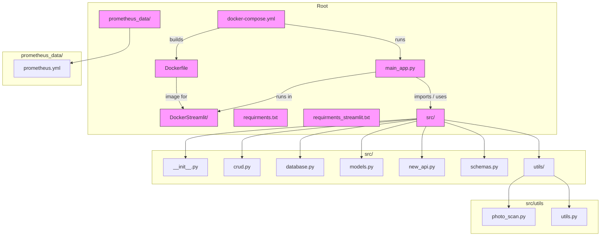

# Repository Overview

This file provides a high-level diagram of the repository structure and relationships using a Mermaid flowchart.

Legend:
- main_app.py — application entrypoint
- Dockerfile, docker-compose.yml — containerization
- DockerStreamlit — folder for Streamlit Docker configuration
- `requirments*.txt` — Python dependencies (note spelling preserved from repo)
- prometheus_data/ — monitoring config
- src/ — application package and modules

If you'd like, I can also render this Mermaid diagram to PNG/SVG, or add it to the README.
